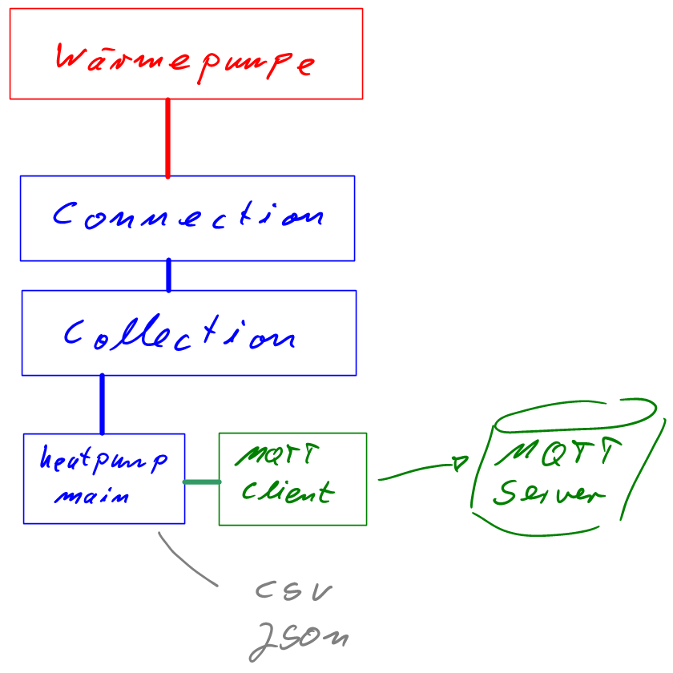
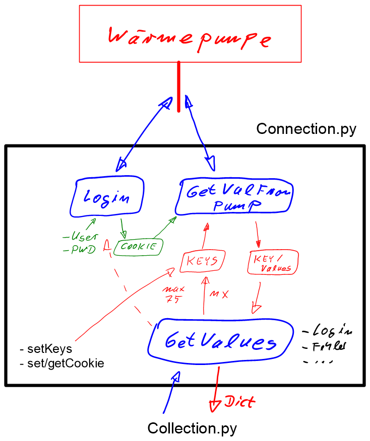
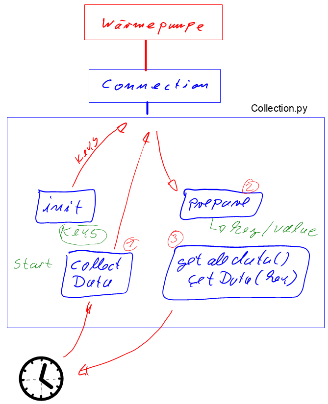

# heatpump_2_mqtt

Mit diesem kleinen Projekt möchte ich die Werte einer Wärmepumpe (aus Herne) 
auslesen und diese als MQTT-Topics bereitstellen.

Anschließend können diese weiterverwendet werden.

## WARNUNG

Es kann KEINE Garantie, Haftung oder überhaupt Irgentetwas übernommen werden.
Es kann passieren, dass die Steuerung der Wärmepumpe durch die Abfragen ZERSTÖRT oder anders beeinflusst wird.
(Die original Webseite der Steuerung mach deutlich mehr Abfragen.)

Die IT-Security dieses Scriptes und der Steuerung sollte man noch untersuchen. Daher sollten solche Systeme nur in einer gesicherten Systemumgebung betrieben werden!


## Abhängigkeiten
  * requests
  * paho-mqtt
  * mqtthandler
  
## Installation auf einem Raspberry Pi 3:
### Voraussetzung:
getestet mit:
  * Raspbian Stretch Lite - Nov.2018
  * Python 3.5.3


### zusätzlich Pakete installieren
```bash
sudo apt install -y python3-requests python3-pip
sudo pip3 install paho-mqtt
```

### Beispiel-Installation
Pfad zum Beispiel: `/opt/heatpump_2_mqtt`

```bash
cd /opt
sudo git clone https://github.com/dk3qu/heatpump_2_mqtt.git
sudo chown -R pi:pi /opt/heatpump_2_mqtt
```

#### Start beim Booten:
`sudo nano /etc/rc.local`
```
#!/bin/sh -e
#
# rc.local
#
# ....... weitere Einstellungen der 'rc.local'

# heatpump_2_mqtt-Prog
cd /opt/heatpump_2_mqtt
su pi -c "nohup /opt/heatpump_2_mqtt/main_heatpump.py >/dev/null 2>&1 &"

exit 0
```

### Config-Files
#### logging.json
Optional

#### config.json
Das Config-File wird in der folgenden Reihenfolge gesucht:
  1. `/etc/heatpump_2_mqtt/config.json`
  2. `<install-path>/config.json`
  
Da hier Passwörter (leider) enthalten sind (), könnten diese in  `/etc/heatpump_2_mqtt/config.json` gespeichert werden.

Kopie erstellen:
```bash
sudo mkdir /etc/heatpump_2_mqtt
sudo cp /opt/heatpump_2_mqtt/config.json /etc/heatpump_2_mqtt/
sudo chown pi:pi /etc/heatpump_2_mqtt/config.json
```
##### Parameter:
Wie lange soll gewartet werden bis es losgeht? 
Nach dem Booten ist es ggf. sinnvoll z.B. 60sek. zu warten ...
```json
  "main": {
    "wait": 60
  },
```
Daten zur Wärmepumpe...
Die Zyklusdauer wird mit `abtastung` eingestellt. Z.B. alle 30sek.
```json
  "heatpump": {
    "ip": "192.168.42.42",
    "port": 80,
    "user": "geHeim",
    "pwd":  "noch-geHeimer",
    "abtastung": 30
  },
```

Parameter zum MQTT-Server. Hier läuft dieser auf dem gleichen Rechner.
```json
  "mqtt": {
    "ip": "127.0.0.1",
    "port": 1883,
    "topics": {
      "root": "wp"
    }
```

Zusätzlich können die Werte in eine CSV- oder JSON-Datei mit Zeitstempel geschrieben werden.
Die JSON-Datei ist nicht ganz korrekt. Jede Zeile ist für sich ein JSON-String, der einen Zyklus entspricht.
(: Darauf achten, dass die Dateien nicht zu groß werden ... LogRotate...)
```json
  "logging": {
    "json": {
      "enable": false,
      "filename": "exp_log.json"
    },
    "csv": {
      "enable": false,
      "filename": "exp_log.csv"
    }
  }
```

# Programmaufbau & -ablauf
## Komponenten

### Connection

#### http-Requests

### Collection



# weitere TODOs 
  * Weitere Werte der Steuerung finden und im Programm einbauen.   
  * Werte, die sich selten ändern, auch selten abrufen...     
  * genauere Fehlerbehandlung
  * MQTT User/Passwort & Verschlüsselung
  * rrdtool für Langzeitprotokollierung (ggf. extra Projekt)     
  * Telegram-Bot zur Abfrage der akt. Werte  (ggf. extra Projekt / oder Integration in div. Hausautomatisierungen)
  * ....
 
  

